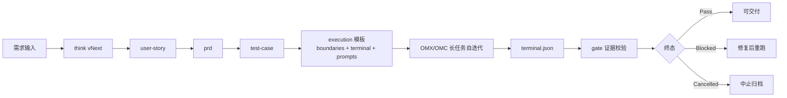

# Product Toolkit

> 通用产品经理工具集（Claude Code / Codex）

## 项目整体说明（覆盖全局）

Product Toolkit 是一个“从需求到可交付证据”的产品协作框架，覆盖：

| 能力层 | 目标 | 典型命令/产物 |
|---|---|---|
| 需求定义层 | 明确问题与范围 | `think` / `user-story` / `prd` / `test-case` |
| 工作流编排层 | 一键生成标准产物链 | `workflow`（`work` 别名） |
| 架构治理层 | 统一架构设计与职责边界 | `architecture/*.md` + `gate` |
| 执行协作层 | 驱动 OMC/OMX 长任务闭环 | `team` / `ralph-bridge` / `auto-test` / `next-step-prompts.md` |
| 交付治理层 | 用证据判定 Done/Blocked | `gate` + `boundaries.md` + `terminal.json` |
| 记忆与追踪层 | 复用历史决策与上下文 | `remember` / `recall` / `.ptk/` 状态文件 |

默认推荐路线（v3.6.0）是：  
`workflow → 产物链（PRD/US/QA）→ execution 模板 → OMC/OMX 执行 → gate 证据校验`  
即：优先“物料驱动 + 证据闭环”，兼容路径再使用桥接能力。

---

## v3.6.1 热修重点（当前推荐）

1. 默认主入口：`/product-toolkit:workflow`（`/product-toolkit:work` 别名）
2. 核心产物链：`think → user-story → prd → test-case`
3. 不新增用户命令，降低使用心智
4. workflow 完成后输出 OMC/OMX 下一步固定提示词（可直接执行）
5. 新增架构治理产物：`system-context / responsibility-boundaries / api-contracts / nfr-budgets / adr-index`
6. 证据闭环：`boundaries.md + terminal.json`
7. 证据加固：`raw-command-log.jsonl + evidence-manifest.json + gate-consistency-report.json`
8. 可执行 gate 校验：
   - `scripts/validate_terminal_artifacts.py`
   - `scripts/check_terminal_artifacts.sh`
9. workflow 终态默认自动收口：`scripts/workflow_gate_autorun.sh`
10. OMC/OMX 是可选执行器，非入侵 PTK 生命周期规划
11. `ralph-bridge` 保留为兼容路径（非默认主路径），并已对齐 v3.6.1 evidence-first 终态要求

v3.6.1 热修说明：`docs/product/v3.6.1/SUMMARY.md`  
v3.6.0 文档索引（3.6.1 延续）：`docs/product/v3.6.0/README.md`

---

## 全量能力地图（主路径 + 扩展）

| 模块 | 典型命令 | 说明 |
|---|---|---|
| 证据闭环主路径 | `workflow` / `work` / `gate` | v3.6.0 默认入口与交付判定 |
| 需求到测试产物 | `think` / `user-story` / `prd` / `test-case` | 标准 PRD/US/QA 产物链 |
| 架构治理产物 | `architecture/*.md` | 系统边界、职责边界、接口契约、NFR、ADR |
| 长任务执行 | `team` / `ralph-bridge` / `auto-test` | OMC/OMX 自迭代执行与验证 |
| 产品分析与策略 | `analyze` / `brainstorm` / `design` / `jtbd` / `kano` / `moscow` | 需求分析、方案发散、优先级 |
| 规划与发布 | `version` / `roadmap` / `release` / `test-progress` / `evolution-summary` | 版本推进、发布与演进复盘 |
| 技术与设计细化 | `wireframe` / `ui-spec` / `api-design` / `data-dictionary` | UI/接口/数据模型配套产物 |
| 记忆与状态 | `remember` / `recall` / `save` / `resume` / `status` | 会话持久化与知识复用 |

说明：README 以 v3.6.0 默认路径为主；完整命令契约见 `commands/product-toolkit.md` 与 `SKILL.md`。

---

## 现有功能模块盘点（代码级视角）

以下盘点基于当前仓库 `skills/`、`scripts/`、`.ptk/` 与 `docs/product/` 的实际结构：

| 模块域 | 代表命令 / 脚本 | 关键状态/产物落点 | 当前能力 |
|---|---|---|---|
| 需求思考与产物链 | `think` / `user-story` / `prd` / `test-case` | `docs/product/{version}/prd|user-story|qa/test-cases` | 从需求到 AC→TC 的标准化产物生成 |
| 工作流编排与交付判定 | `workflow` / `work` / `gate` / `workflow_gate_autorun.sh` | `execution/boundaries.md` + `execution/terminal.json` + 一致性/manifest 报告 | evidence-first 终态收口（Pass/Blocked） |
| 架构治理 | `architecture/*.md` + `check_gate_consistency.py` | `architecture/system-context|responsibility|api-contracts|nfr|adr` | 架构边界、契约漂移、NFR 预算纳入 gate |
| 多代理执行运行时 | `team_runtime.sh` / `review_gate.sh` / `team_report.sh` | `.ptk/state/team/<team>/manifest.json`、`review-gates.json`、`reports/*` | file/tmux runtime、spec→quality 双审查、fix loop 控制 |
| Ralph 兼容桥接 | `ralph_bridge.sh` | `.ptk/state/bridge/<team>/ralph-link.json` | 把 OMX/OMC 长任务状态映射回 PTK 生命周期 |
| 自动测试与反馈回写 | `auto_test.sh` / `feedback_from_test.py` | `.ptk/state/test-sessions/*.json`、`test-progress.json`、`requirement-feedback/*.json` | start-record-stop-consolidate 生命周期、阻塞原因归因、反馈注入下一轮 |
| 记忆系统 | `remember` / `recall` / `migrate_memory_v3.py` | `.ptk/memory/*.json` + schema | 洞察/决策/术语/测试踩坑记忆的跨会话复用 |
| 状态持久化 | `save` / `resume` / `status` | `.ptk/state/*.json`（含 schema） | 会话恢复、阶段追踪、门控上下文保留 |
| 产品规划扩展能力 | `version` / `roadmap` / `release` / `evolution-summary` | `docs/product/{version}/...` | 版本规划、发布检查、演进复盘 |
| 方法论与分析工具 | `analyze` / `brainstorm` / `design` / `jtbd` / `kano` / `moscow` / `persona` | `docs/product/*` 对应输出目录 | 需求分析、方案发散、优先级与用户画像支持 |

---

## 一图看懂 v3.6.0 完整执行工作流



---

## 快速开始（推荐）

### A. 一键主路径

```bash
/product-toolkit:workflow 社区点赞功能
```

### B. 分步主路径

```bash
/product-toolkit:think 社区点赞功能
/product-toolkit:user-story 社区点赞功能
/product-toolkit:prd 社区点赞功能
/product-toolkit:test-case 社区点赞功能
```

---

## 10 分钟上手演示（copy & run）

```bash
# 1) 进入仓库
cd /你的路径/product-toolkit

# 2) 跑一键 workflow（示例功能）
/product-toolkit:workflow 社区点赞功能

# 3) 快速确认 v3.6.0 关键产物
ls -la docs/product/v3.6.0/prd/
ls -la docs/product/v3.6.0/user-story/
ls -la docs/product/v3.6.0/qa/test-cases/
ls -la docs/product/v3.6.0/architecture/
ls -la docs/product/v3.6.0/execution/

# 4) 执行终态校验（release=Pass, blocked=Blocked）
./scripts/check_terminal_artifacts.sh --version v3.6.0

# 5) 证据加固（可选但推荐）
python3 scripts/check_gate_consistency.py --version v3.6.0 \
  --terminal docs/product/v3.6.0/execution/terminal.release-sample.json \
  --output docs/product/v3.6.0/execution/gate-consistency.release-sample.json

python3 scripts/build_evidence_manifest.py \
  --terminal docs/product/v3.6.0/execution/terminal.release-sample.json \
  --output docs/product/v3.6.0/execution/evidence-manifest.release-sample.json
```

完成标准：

- 能看到 PRD / User Story / Test Cases / Execution 模板文件
- `check_terminal_artifacts.sh` 输出 PASS

失败时如何排查（3步）：

1. **先看 reason codes（定位方向）**
   ```bash
   python3 scripts/validate_terminal_artifacts.py \
     --version v3.6.0 \
     --terminal docs/product/v3.6.0/execution/terminal.release-sample.json \
     --pretty
   ```
2. **再看文件是否缺失（定位路径问题）**
   ```bash
   ls -la docs/product/v3.6.0/execution/
   ```
   重点检查：`boundaries.md`、`terminal.json`、`next-step-prompts.md`、`architecture/*.md`
3. **最后看证据引用是否失效（定位内容问题）**
   - 打开 `terminal.release-sample.json` / `terminal.blocked-sample.json`
   - 核对 `traceability[].evidence_refs` 与 `evidence.*` 路径是否真实存在

常见 reason code 对照表（原因 → 修复动作）：

| reason_code | 常见原因 | 建议修复动作 |
|---|---|---|
| `boundaries_missing` | 缺少 `execution/boundaries.md` | 补齐边界模板并确认 In/Out Scope、Done、Blocked 条件 |
| `boundaries_schema_invalid` | boundaries 关键章节缺失 | 补齐章节：In Scope / Out of Scope / Done / Blocked / 输出产物 |
| `terminal_artifact_missing` | 缺少 `execution/terminal.json` 或指定终态文件 | 先生成终态文件，再执行 gate 校验 |
| `terminal_schema_invalid` | terminal 结构不合法（字段缺失/类型错误） | 按 `execution/terminal.json` 模板对齐字段与类型 |
| `terminal_status_invalid` | `terminal.status` 非 `Pass/Blocked/Cancelled` | 修正为合法终态值 |
| `blocking_open_question_exists` | 仍有 blocking 未决项未关闭 | 在 next_round 中关闭/降级该问题，再重跑校验 |
| `ac_tc_mapping_gap` | 存在 AC 未映射 TC（如 `tc_ids` 为空） | 补齐 AC→TC 映射并更新 traceability |
| `terminal_evidence_missing` | evidence 引用路径不存在 | 修正或补齐被引用的报告/日志/证据文件 |
| `evidence_ref_path_style_inconsistent` | 证据路径风格不一致 | 统一为仓库相对路径（推荐 `docs/...` 或项目根相对路径） |
| `arch_artifact_missing` | 缺少 architecture 关键文档 | 补齐 `architecture/system-context/responsibility/contracts/nfr/adr` |
| `ownership_boundary_unclear` | 职责边界未确认或越权 | 更新 `responsibility-boundaries.md` 并在 terminal 回填确认 |
| `api_contract_drift` | 存在未解决契约漂移 | 在 `api-contracts.md` 标记修复/接受，并补证据 |
| `nfr_budget_unproven` | 关键 NFR 无法证明达标 | 在 `nfr-budgets.md` 补齐测量证据或降级为 Blocked |
| `evidence_integrity_missing` | terminal 缺少证据加固元信息 | 补齐 `evidence_integrity` 字段 |
| `raw_command_log_missing` | 未提供 raw command log | 用 `run_command_with_evidence.py` 生成 jsonl 原始执行记录 |
| `raw_command_log_invalid` | raw command log 行格式不合法 | 每行必须含 `cmd/cwd/started_at/ended_at/exit_code` |
| `evidence_sha256_manifest_missing` | 缺少 sha256 manifest | 运行 `build_evidence_manifest.py` 生成 |
| `evidence_sha256_manifest_invalid` | manifest 结构错误或包含无效条目 | 修复 manifest schema 并重生 |
| `evidence_sha256_manifest_incomplete` | manifest 未覆盖关键证据 | 重新生成并覆盖 terminal 引用路径 |
| `evidence_sha256_manifest_mismatch` | 证据文件与哈希不一致 | 重新执行并固化证据，避免篡改风险 |
| `gate_consistency_report_missing` | 缺少一致性报告 | 运行 `check_gate_consistency.py` 输出报告 |
| `gate_consistency_report_invalid` | 一致性报告格式非法 | 修复 `status/conflicts` 结构 |
| `gate_consistency_report_mismatch` | 报告与实时校验不一致 | 重新执行一致性校验并覆盖报告 |
| `gate_consistency_conflict` | terminal 与架构文档结论冲突 | 对齐 terminal、api-contracts、nfr-budgets 后再判 Pass |

---

## v3.6.0 标准交付步骤（重点）

### Step 1) 产物必须齐全

至少应存在：

- `docs/product/{version}/prd/{feature}.md`
- `docs/product/{version}/user-story/{feature}.md`
- `docs/product/{version}/qa/test-cases/{feature}.md`
- `docs/product/{version}/architecture/system-context.md`
- `docs/product/{version}/architecture/responsibility-boundaries.md`
- `docs/product/{version}/architecture/api-contracts.md`
- `docs/product/{version}/architecture/nfr-budgets.md`
- `docs/product/{version}/architecture/adr-index.md`
- `docs/product/{version}/execution/boundaries.md`
- `docs/product/{version}/execution/terminal.json`
- `docs/product/{version}/execution/raw-command-log.jsonl`
- `docs/product/{version}/execution/evidence-manifest.json`
- `docs/product/{version}/execution/gate-consistency-report.json`

### Step 2) 使用固定下一步模板驱动 OMC/OMX

从以下文件复制提示词执行：

- `docs/product/{version}/execution/next-step-prompts.md`

要求：

- 以 `boundaries.md` 判定范围
- 以 `architecture/*.md` 约束架构边界与职责
- 以 `AC→TC→Evidence` 判定完成
- 终态必须落盘 `terminal.json`

### Step 3) 证据校验（交付前必须）

```bash
# v3.6.1 默认自动收口（推荐）
./scripts/workflow_gate_autorun.sh \
  --version v3.6.0 \
  --terminal docs/product/v3.6.0/execution/terminal.release-sample.json

# 快速回归：release 样例必须 Pass，blocked 样例必须 Blocked
./scripts/check_terminal_artifacts.sh --version v3.6.0

# 或按单文件精查
python3 scripts/validate_terminal_artifacts.py \
  --version v3.6.0 \
  --terminal docs/product/v3.6.0/execution/terminal.release-sample.json \
  --pretty

# 一致性报告（terminal vs architecture）
python3 scripts/check_gate_consistency.py \
  --version v3.6.0 \
  --terminal docs/product/v3.6.0/execution/terminal.release-sample.json \
  --output docs/product/v3.6.0/execution/gate-consistency.release-sample.json

# 证据哈希清单
python3 scripts/build_evidence_manifest.py \
  --terminal docs/product/v3.6.0/execution/terminal.release-sample.json \
  --output docs/product/v3.6.0/execution/evidence-manifest.release-sample.json
```

### Step 4) Blocked 回归演练（建议每次发版前执行）

- 演练清单：`docs/product/v3.6.0/execution/blocked-drill-checklist.md`
- 演练样例：`docs/product/v3.6.0/execution/terminal.blocked-sample.json`
- 演练结果：`docs/product/v3.6.0/execution/blocked-drill-result.md`

---

## 兼容路径（非默认）

| 命令 | 用途 |
|---|---|
| `/product-toolkit:team` | 多代理协作运行时 |
| `/product-toolkit:ralph-bridge` | OMX/OMC 长任务桥接（兼容保留） |
| `/product-toolkit:auto-test` | 自动化测试执行（执行层） |
| `/product-toolkit:gate` | strict 门控检查 |

---

## v3.6.0 关键目录

```text
docs/product/v3.6.0/
├── README.md
├── SUMMARY.md
├── prd/workflow-evidence-first.md
├── user-story/workflow-evidence-first.md
├── qa/test-cases/workflow-evidence-first.md
├── architecture/
│   ├── README.md
│   ├── system-context.md
│   ├── responsibility-boundaries.md
│   ├── api-contracts.md
│   ├── nfr-budgets.md
│   └── adr-index.md
└── execution/
    ├── boundaries.md
    ├── terminal.json
    ├── terminal.release-sample.json
    ├── terminal.blocked-sample.json
    ├── raw-command-log.release-sample.jsonl
    ├── raw-command-log.blocked-sample.jsonl
    ├── evidence-manifest.release-sample.json
    ├── evidence-manifest.blocked-sample.json
    ├── gate-consistency.release-sample.json
    ├── gate-consistency.blocked-sample.json
    ├── next-step-prompts.md
    ├── gate-architecture-checklist.md
    ├── blocked-drill-checklist.md
    ├── blocked-drill-result.md/.json
    ├── delivery-report.md
    └── review-v3.6.0-fix-report.md
```

## 项目目录（全局）

```text
product-toolkit/
├── commands/                 # 子命令入口说明
├── skills/                   # 各能力 SKILL.md（workflow/gate/team/...）
├── docs/product/             # 各版本产品文档与执行证据
├── scripts/                  # 校验与辅助脚本
└── .ptk/                     # 运行态/记忆/状态快照
```

---

## 未来可探索迭代 TODO（文档规划，不代表版本变更）

> 说明：本节是 backlog 建议清单，用于后续规划；不意味着当前版本号变更。

### P0（优先补齐体验闭环）

1. **统一全流程状态看板命令**  
   将 think/workflow/team/bridge/auto-test/feedback 聚合为单入口（支持 `--json`）。
2. **`status` 技能脚本化落地**  
   把当前说明型状态面板变为可执行脚本，避免“有说明无实现”。
3. **测试反馈镜像一致性校验**  
   增加对 `.ptk/state/requirement-feedback` 与 `docs/product/*/feedback` 的一致性检查。
4. **manual-results 交互辅助**  
   为 manual/api 用例提供“待回填项清单 + 快速模板”减少 `manual_result_missing`。

### P1（提升治理与自动化程度）

5. **reason code 处置知识库**  
   建立 reason code → 修复动作 → 验证命令的结构化索引（可机读）。
6. **workflow/think 运行态落盘统一**  
   统一 `think-progress` / `workflow-state` 的真实写入与恢复策略。
7. **门控前置 CI 校验**  
   在 CI 中默认执行 terminal/schema/consistency/manifest 检查，提前阻断不合格交付。
8. **team 报告趋势化**  
   增加 fix loop、blocked reason、phase 耗时的时间序列统计。

### P2（增强智能化与可视化）

9. **跨版本质量趋势看板**  
   统计 Pass/Blocked、reason codes、覆盖率变化趋势。
10. **记忆驱动的风险预测**  
    基于 `test-learnings` signatures/playbooks 提前提示高风险变更点。
11. **证据关系图谱**  
    从 AC→TC→Evidence→Terminal 生成可视化依赖图。
12. **通知与协作集成**  
    支持 blocked 事件推送（如 webhook/IM）与责任人自动分发。

---

## 安装

### Claude Code

```bash
claude plugin marketplace add /绝对路径/product-toolkit
claude plugin install product-toolkit@product-toolkit-dev
claude plugin list
```

### Codex

```bash
git clone https://github.com/justin-mc-lai/product-toolkit ~/.codex/product-toolkit
mkdir -p ~/.agents/skills
ln -s ~/.codex/product-toolkit ~/.agents/skills/product-toolkit
```

---

## 版本摘要

| 版本 | 日期 | 重点 |
|---|---|---|
| v3.6.0 | 2026-02-27 | workflow 主路径聚焦 PRD/US/QA；evidence-first；终态可执行校验 |
| v3.5.x | 2026-02-26 | team runtime / ralph bridge / strict feedback 闭环 |
| v3.4.x | 2026-02-26 | strict 默认、反馈回写、双审查 gate |

---

## 参考

- `SKILL.md`
- `commands/product-toolkit.md`
- `skills/workflow/SKILL.md`
- `skills/gate/SKILL.md`
