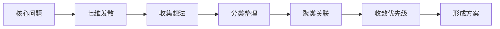

# 苏格拉底式产品构建与网状思维提问

> 本文档为 product-toolkit skill 的核心参考文档，包含完整的苏格拉底式追问和网状思维发散提问框架。每个问题都提供可选项，**支持自定义回答**，方便用户快速选择。

## 使用说明

- **每次追问**：3-8 个问题
- **回答方式**：选择选项 OR 自定义回答
- **问题层次**：澄清 → 假设 → 边界 → 验收 → 影响
- **目标**：确保产品思考能影响迭代用户故事

---

## 1. 苏格拉底式产品构建

### 1.1 核心理念

苏格拉底式追问通过连续提问帮助产品经理深入思考、澄清假设、发现遗漏，最终构建更完整的产品方案。**不是直接给出答案，而是引导用户自己找到答案**。

### 1.2 提问层次模型

```
层次一：澄清问题 (Clarification)     → 用户到底要什么？
层次二：探索假设 (Assumptions)       → 我们假设了什么？
层次三：用户故事边界 (Boundaries)   → 影响用户故事的关键边界
层次四：验收标准 (Acceptance)       → 成功/失败/边界定义
层次五：评估影响 (Implications)      → 不做/做会怎样？
```

---

### 1.3 批量追问框架（核心）

#### 第一轮：澄清问题（4-5 个问题）

一次性列出所有问题，用户可选择回答：

```
## 第一轮：澄清问题

请回答以下问题（可选择选项或自定义回答）：

### Q1: 这个功能解决什么问题？
- A. 效率问题 - 让用户更快完成任务
- B. 认知问题 - 帮助用户更好理解信息
- C. 情感需求 - 满足用户情感/社交需求
- D. 痛点 - 消除现有不便/困扰
- E. 新机会 - 开拓新的用户场景
- 自定义：_______________

### Q2: 目标用户是谁？
- A. 消费者 - 浏览为主，互动为辅
- B. 创作者 - 生产内容，关注曝光
- C. 商家 - 商业目的，追求转化
- D. 管理员 - 管理内容，运营平台
- E. 混合角色 - 以上多种身份兼具
- 自定义：_______________

### Q3: 用户在什么场景下使用？
- A. 碎片时间 - 通勤、排队、等电梯
- B. 专注时间 - 晚上、周末、假期
- C. 工作场景 - 上班、开会、外出
- D. 生活场景 - 家里、商场、餐厅
- 自定义：_______________

### Q4: 用户现在怎么解决？
- A. 竞品 - 用户在使用竞品的类似功能
- B. 替代功能 - 用其他功能间接满足
- C. 线下/人工 - 线下完成或找人帮忙
- D. 凑合 - 忍受不便，暂未解决
- E. 无方案 - 暂时没有解决方案
- 自定义：_______________

### Q5: 为什么现在做？
- A. 时机成熟 - 市场/技术/资源到位
- B. 竞争压力 - 竞品在做
- C. 用户呼声 - 用户强烈要求
- D. 业务需求 - 商业目标驱动
- E. 技术债务 - 必须重构
- 自定义：_______________
```

---

#### 第二轮：探索假设（3-4 个问题）

```
## 第二轮：探索假设

### Q6: 不做这个功能会怎样？
- A. 用户流失 - 用户转向竞品
- B. 体验不完整 - 缺少关键功能
- C. 商业受损 - 影响收入
- D. 品牌影响 - 影响品牌形象
- E. 无影响 - 锦上添花，非必需
- 自定义：_______________

### Q7: 我们假设了什么？（可多选）
- [ ] 假设用户愿意花时间学习使用
- [ ] 假设用户有这个真实需求
- [ ] 假设竞品没做好，我们能做好
- [ ] 假设这个需求足够普遍
- [ ] 假设技术可以实现
- 自定义补充：_______________

### Q8: 最大的风险是什么？
- A. 技术风险 - 实现难度大
- B. 市场风险 - 用户不接受
- C. 运营风险 - 推广困难
- D. 竞争风险 - 竞品先发
- 自定义：_______________

### Q9: 做这个功能的目标是什么？
请描述预期达成的目标：_______________
```

---

#### 第三轮：用户故事边界追问（5-6 个问题）

> **关键**：这轮追问直接影响用户故事的验收标准

```
## 第三轮：用户故事边界（影响用户故事）

### Q10: 哪些角色可以使用这个功能？
- A. 所有登录用户
- B. 指定角色用户（如会员/管理员）
- C. 特定条件用户（如完成实名认证）
- D. 付费用户
- 自定义：_______________

### Q11: 什么情况下不能用？（前置条件/边界）
- A. 未登录用户
- B. 账号异常用户（封禁/未激活）
- C. 设备/环境限制
- D. 频次/次数限制
- 自定义：_______________

### Q12: 操作有次数/频率限制吗？
- A. 无限制
- B. 每日限制 __ 次
- C. 每周限制 __ 次
- D. 总计限制 __ 次
- 自定义：_______________

### Q13: 数据从哪里来？到哪里去？（数据流）
- 数据来源：_______________
- 数据去向：_______________
- 需要存储吗？Y/N
- 需要同步其他系统吗？Y/N

### Q14: 需要权限控制吗？
- A. 不需要 - 公开功能
- B. 需要登录 - 未登录引导登录
- C. 需要角色 - 指定角色才能用
- D. 需要权限 - 特定权限才能用
- 自定义：_______________

### Q15: 操作可以撤销/回退吗？
- A. 可以撤销 - 支持撤销/回退
- B. 不可撤销 - 操作后无法恢复
- C. 有时效 - 多少时间内可撤销
- 自定义：_______________
```

---

#### 第四轮：验收标准细化（4-5 个问题）

> **关键**：直接影响 QA 测试用例生成

```
## 第四轮：验收标准细化（影响 QA 用例）

### Q16: 成功是什么样子？（正向流程）
请描述核心流程：_______________

### Q17: 失败是什么样子？（错误处理）
- A. 提示友好错误信息
- B. 静默失败，后台记录
- C. 阻断流程，无法继续
- D. 部分成功，部分失败
- 自定义：_______________

### Q18: 边界在哪里？（边界校验）
请列出边界值：
- 最大值：_______________
- 最小值：_______________
- 格式要求：_______________
- 特殊字符：_______________

### Q19: 用户怎么知道成功了？（成功反馈）
- A. 页面跳转 - 跳转到成功页
- B. 状态变化 - 按钮状态/列表变化
- C. 消息提示 - Toast/弹窗提示
- D. 消息通知 - 短信/邮件/推送
- 自定义：_______________

### Q20: 响应时间要求？（性能）
- A. 实时 (< 1秒)
- B. 普通 (< 3秒)
- C. 异步 - 可等待
- D. 无要求
- 自定义：_______________
```

---

#### 第五轮：评估影响（3-4 个问题）

```
## 第五轮：评估影响

### Q21: 对其他功能有什么影响？
- 依赖关系 - 需要先完成：_______________
- 冲突关系 - 可能影响：_______________
- 辅助关系 - 可以增强：_______________

### Q22: 上线后怎么看效果？
请描述衡量指标：_______________

### Q23: 数据从哪里获取？
- A. 已有数据 - 不需要新增
- B. 需要埋点 - 需新增数据采集
- C. 需要问卷 - 需用户反馈收集
- D. 需要竞品调研
- 自定义：_______________

### Q24: 回滚方案是什么？
请描述回滚方案：_______________
```

---

### 1.4 用户故事边界追问映射表

| 用户故事要素 | 对应问题 | 输出到用户故事 |
|-------------|---------|---------------|
| **Actor（角色）** | Q10, Q14 | 用户故事角色 |
| **前置条件** | Q11, Q14 | 前置条件 |
| **业务限制** | Q12, Q13 | 验收标准-边界校验 |
| **核心流程** | Q16 | 验收标准-正向流程 |
| **错误处理** | Q17 | 验收标准-错误处理 |
| **边界值** | Q18 | 验收标准-边界校验 |
| **成功反馈** | Q19 | 验收标准-成功反馈 |
| **性能要求** | Q20 | 验收标准-性能 |
| **撤销/回退** | Q15 | 验收标准-边界处理 |
| **数据依赖** | Q13, Q23 | 功能需求 |
| **影响分析** | Q21 | 非功能需求 |

---

### 1.5 苏格拉底追问完整模板

#### 需求挖掘模板

```markdown
## 需求澄清问题集

### 基础信息
- [ ] 描述这个功能的典型使用场景
- [ ] 用户的真实痛点是什么？
- [ ] 不解决这个问题有什么后果？
- [ ] 用户现在用什么替代方案？

### 角色确认
- [ ] 谁是主要用户？年龄/职业/使用习惯？
- [ ] 是新用户还是老用户？
- [ ] 是移动端还是PC端使用更多？

### 价值确认
- [ ] 这个功能解决什么问题？
- [ ] 对用户有什么价值？
- [ ] 怎么衡量这个功能成功了？

### 边界确认（影响用户故事）
- [ ] 哪些角色可以用？
- [ ] 什么情况下不能用？
- [ ] 有操作限制吗？
- [ ] 需要权限控制吗？

### 验收标准确认（影响 QA）
- [ ] 核心流程是什么？
- [ ] 失败怎么处理？
- [ ] 边界值有哪些？
- [ ] 成功反馈是什么？
- [ ] 性能要求？

### 优先级判断
- [ ] 如果只做20%，你会做哪部分？
- [ ] 没有这个功能产品能用吗？
- [ ] 竞品都有这个功能吗？
```

---

#### PRD评审模板

```markdown
## PRD评审苏格拉底问题

### 关于目标
- [ ] 这个需求的目标是什么？
- [ ] 怎么量化这个目标？
- [ ] 目标用户是谁？

### 关于方案
- [ ] 为什么选这个方案？
- [ ] 有没有更简单的方案？
- [ ] 这个方案有什么风险？

### 关于实现
- [ ] 技术上有什么难点？
- [ ] 需要多长时间？
- [ ] 需要哪些人配合？

### 关于验证
- [ ] 上线后怎么看效果？
- [ ] 数据指标是什么？
- [ ] 达到多少算成功？
```

---

## 2. 网状思维与发散提问

### 2.1 核心理念

网状思维不是线性思考，而是从一个点出发，像神经网络一样向多个方向发散，**发现隐藏的联系和可能性**。

### 2.2 发散维度框架

```
                    ┌── 用户维度
                    │
      ┌─────────────┼── 场景维度 ────────────┐
      │             │                       │
      │             └── 业务维度 ────────────┼── 技术维度
      │                                   │   │
      │                                   └── 体验维度
      │                                       │
      └── 价值维度 ────────────────────────────┘
```

### 2.3 七维发散提问法（带选项框架）

#### 维度一：用户维度

**问题：这个功能的核心用户是谁？**

| 选项 | 用户类型 | 特征 |
|------|---------|------|
| A | 年轻用户 | 18-25岁，追求新鲜，爱分享 |
| B | 成熟用户 | 26-40岁，注重效率，实用主义 |
| C | 老年用户 | 45+，操作简单，界面清晰 |
| D | 专业用户 | 高频使用，功能全面 |
| E | 休闲用户 | 低频使用，功能简单 |

**扩展问题**：
- 谁还会用？（潜在用户）_______________
- 谁一定不用？（排斥用户）_______________

---

#### 维度二：场景维度

**问题：用户会在什么场景下使用？**

| 场景类型 | 是/否 | 具体场景 |
|---------|-------|---------|
| 碎片时间 | 是/否 | 通勤、排队、等电梯 |
| 专注时间 | 是/否 | 晚上、周末、假期 |
| 工作场景 | 是/否 | 上班、开会、外出办公 |
| 生活场景 | 是/否 | 家里、商场、餐厅 |

**触发场景**：用户什么情况下会想到用这个功能？
_______________

**连续场景**：用户使用前一步做什么？使用后一步做什么？
- 前：_______________
- 后：_______________

---

#### 维度三：业务维度

**问题：这个功能怎么赚钱？**

| 商业模式 | 适合度 | 说明 |
|---------|-------|------|
| 付费会员 | ★★★★★ | 高级功能付费 |
| 广告变现 | ★★★★☆ | 展示广告/信息流 |
| 交易抽成 | ★★★☆☆ | 交易流水抽成 |
| 增值服务 | ★★★☆☆ | 道具/周边付费 |
| 暂不考虑 | ★★☆☆☆ | 先做用户规模 |

**竞品分析**：主要竞品怎么做？
- 竞品A：_______________
- 竞品B：_______________
- 差异化机会：_______________

---

#### 维度四：技术维度

**问题：技术实现的主要挑战？**

| 挑战类型 | 难度 | 应对方案 |
|---------|-----|---------|
| 性能要求 | 高/中/低 | |
| 实时性 | 高/中/低 | |
| 兼容性 | 高/中/低 | |
| 数据量 | 大/中/小 | |
| 第三方依赖 | 多/少 | |

---

#### 维度五：体验维度

**问题：用户使用这个功能的关键体验？**

| 体验点 | 重要度 | 当前方案 |
|-------|-------|---------|
| 操作简单 | ★★★★★ | |
| 反馈及时 | ★★★★☆ | |
| 界面美观 | ★★★☆☆ | |
| 学习成本低 | ★★★★☆ | |
| 成就感 | ★★★☆☆ | |

**用户使用这个功能时的情绪曲线**：
- 使用前：好奇 / 期待 / 困惑 / 无感
- 使用中：顺畅 / 挫败 / 惊喜 / 耐心
- 使用后：满足 / 失望 / 惊喜 / 无感

---

#### 维度六：价值维度

**问题：这个功能的核心价值？**

| 价值类型 | 优先级 | 说明 |
|---------|-------|------|
| 功能价值 | ★★★★★ | 解决实际问题 |
| 情感价值 | ★★★★☆ | 满足情感需求 |
| 社交价值 | ★★★☆☆ | 促进社交互动 |
| 经济价值 | ★★★☆☆ | 省钱/赚钱 |
| 品牌价值 | ★★☆☆☆ | 提升品牌形象 |

**长期价值**：_______________

---

#### 维度七：风险维度

**问题：可能的风险及应对？**

| 风险类型 | 概率 | 影响 | 应对方案 |
|---------|-----|-----|---------|
| 用户不用 | 高/中/低 | 大/小 | |
| 竞品抄袭 | 高/中/低 | 大/小 | |
| 技术问题 | 高/中/低 | 大/小 | |
| 政策风险 | 高/中/低 | 大/小 | |
| 运营压力 | 高/中/低 | 大/小 | |

---

### 2.4 发散思维工作流



### 2.5 发散练习模板

```markdown
## 功能发散练习：{功能名称}

### 用户维度
- 主要用户：
- 潜在用户：
- 不用这个功能的用户：

### 场景维度
- 使用时间：
- 使用地点：
- 使用状态：
- 触发场景：

### 业务维度
- 商业模式：
- 竞品做法：
- 差异化：

### 体验维度
- 用户感受：
- 关键体验点：
- 可能的问题：

### 风险维度
- 潜在风险：
- 应对方案：
```

---

## 3. 组合使用指南

### 3.1 需求挖掘阶段：先发散后收敛

```
1. 网状发散（收集可能性）
   → 用七维提问法广泛探索

2. 收敛（聚焦核心）
   → 用MoSCoW排序

3. 苏格拉底深挖（验证假设）
   → 针对核心需求连续追问
```

### 3.2 PRD评审阶段：苏格拉底为主

```
1. 澄清问题
   → "这个需求到底是什么？"

2. 探索假设
   → "我们假设了什么？"

3. 追溯原因
   → "为什么这样设计？"

4. 评估影响
   → "不做会怎样？做会怎样？"
```

### 3.3 日常思考：网状思维

```
遇到任何产品问题 →
发散提问（至少3个维度）→
记录所有想法 →
分类整理 →
找关联 →
收敛成行动项
```

---

## 4. 快速调用模板

### 苏格拉底追问快捷调用

```
需求不清晰时 → 用「需求澄清问题集」
PRD评审时 → 用「PRD评审苏格拉底问题」
设计犹豫时 → 用「功能边界问题」
```

### 网状思维快捷调用

```
头脑风暴 → 用「七维发散提问法」
功能探索 → 用「功能发散练习模板」
方案选择 → 用「多维度对比表」
```

---

## 5. 常见场景应用

### 场景一：用户说"我要做一个XX功能"

```
第一轮（发散）：
- "你希望通过这个功能解决什么问题？"
- "用户现在的痛点是什么？"
- "竞品有这个功能吗？"

第二轮（收敛）：
- "如果只能做一个核心功能，是什么？"
- "这个功能和产品战略一致吗？"

第三轮（深挖）：
- "用户真的需要这个吗？"
- "没有这个功能用户怎么办？"
- "做这个的风险是什么？"
```

### 场景二：需求评审

```
"这个需求的目标是什么？"
"怎么衡量做成功了？"
"为什么现在做？"
"不做会怎样？"
"技术实现有什么难点？"
"对其他功能有什么影响？"
"用户体验有什么风险？"
"竞品是怎么做的？"
```

### 场景三：功能迭代

```
"为什么要改这个功能？"
"数据上有什么问题？"
"用户反馈是什么？"
"改完之后预期数据是什么？"
"怎么验证改对了？"
"回滚方案是什么？"
```
